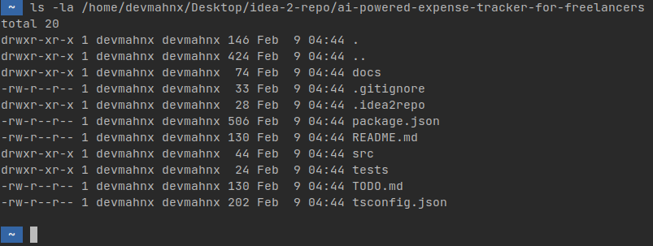
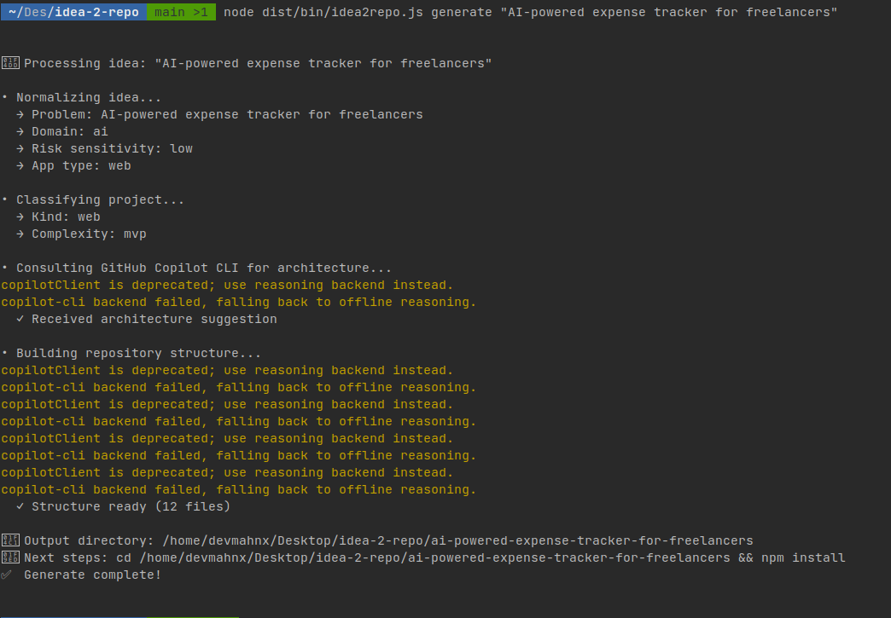
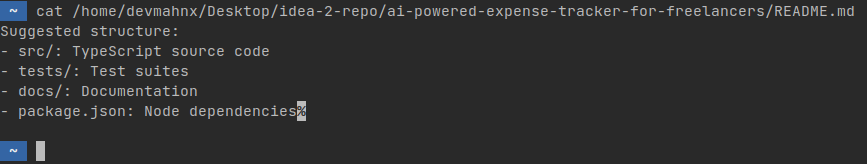
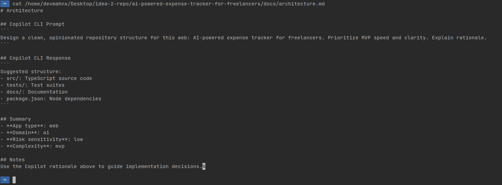

# idea2repo: Transform Your Ideas Into Intelligent Repository Scaffolds with GitHub Copilot CLI

*This is a submission for the [GitHub Copilot CLI Challenge](https://dev.to/challenges/github-2026-01-21)*

## What I Built

**idea2repo** is a command-line tool that solves a real problem every developer faces: **starting a new project**.

Instead of staring at a blank folder, developers describe their idea in plain English, and `idea2repo` uses **GitHub Copilot CLI as a co-founder** to generate:

- A sensible, opinionated repository structure
- A clear, realistic README
- Architecture documentation
- Actionable MVP TODOs
- Explainable architectural decisions

### The Core Insight

Most project scaffolding tools are **template matchers**—you select from pre-built options. `idea2repo` is different. It **delegates architectural reasoning to GitHub Copilot CLI**, enabling context-aware, intelligent decisions reasoned from first principles.

Instead of:
```bash
scaffolder --template react-web-app
```

You get:
```bash
idea2repo generate "Marketplace for verified land listings in Kenya"
```

And receive a repo structure tailored to your specific problem, not a generic template.

### Core Features & Technology

✅ **Intelligent Idea Understanding** - Normalizes plain-English ideas into structured intent; detects domain, risk level, app type, and target region

✅ **Context-Aware Architecture** - Uses GitHub Copilot CLI to reason about project structure; considers team size, timeline, and complexity; proposes tech stack with tradeoffs

✅ **Complete Repository Generation** - Folder structure, README, architecture documentation, MVP roadmap, and package.json with sensible dependencies

✅ **Explainable Decisions** - Every architectural choice is justified with reasoning captured from Copilot CLI

**Project Stats:**
- **Language**: TypeScript (strict mode)
- **Test Coverage**: 83% (8/8 tests passing ✅)
- **CLI Framework**: Commander.js
- **Main Integration**: `gh copilot suggest` and `gh copilot explain`

### Repository Structure

```
idea2repo/
├─ src/
│  ├─ cli/                 (command routing)
│  ├─ core/                (idea normalization, classification)
│  ├─ copilot/             (GitHub Copilot CLI integration)
│  ├─ scaffold/            (file generation)
│  └─ commands/            (generate, init, explain)
├─ docs/
│  ├─ architecture.md
│  ├─ copilot-usage.md     (detailed integration docs)
│  ├─ philosophy.md
│  └─ limitations.md
├─ tests/                  (83% coverage)
└─ examples/               (3 walkthrough examples)
```



---

## Demo

### Try it yourself

**Repository**: [github.com/GeoAziz/idea-2-repo](https://github.com/GeoAziz/idea-2-repo)

### Live Example: AI-Powered Expense Tracker

```bash
$ idea2repo generate "AI-powered expense tracker for freelancers"

📝 Processing idea: "AI-powered expense tracker for freelancers"

• Normalizing idea...
  → Problem: Track and categorize expenses with AI
  → Domain: fintech
  → Risk sensitivity: medium
  → App type: web-app

• Classifying project...
  → Kind: web
  → Complexity: medium

• Consulting GitHub Copilot CLI for architecture...
  ✓ Received architecture suggestion

• Building repository structure...
  ✓ Structure ready (18 files)

✅ Generate complete!

Your repo scaffold is ready. Next steps:
1. cd my-project
2. npm install
3. Read docs/architecture.md
4. Start with TODO.md
```



### Generated Output: README Preview



### Explainability in Action

```bash
$ idea2repo explain "Why PostgreSQL?"

Based on your project (AI expense tracker):

1. **Data Integrity**: Expense records need ACID guarantees
2. **Query Flexibility**: Financial categorization requires complex queries
3. **Cost**: PostgreSQL is OSS, Firebase could grow expensive
4. **Alternatives**: 
   - MongoDB: Less structured for financial data
   - Firebase: Good for MVP, but lock-in risk
```

---

## My Experience with GitHub Copilot CLI

### Why Copilot CLI Was Essential

Without GitHub Copilot CLI, `idea2repo` would need hundreds of hardcoded rules, heuristics, and template matching logic. Copilot CLI enabled **agentic reasoning**—instead of rules, I ask intelligent questions and get thoughtful architectural recommendations from first principles.

### How I Integrated Copilot CLI

```typescript
// src/copilot/copilotClient.ts
export async function suggest(prompt: string): Promise<string> {
  try {
    const cmd = `gh copilot suggest "${prompt.replace(/"/g, '\\"')}"`;
    const result = execSync(cmd, { encoding: 'utf8' });
    return result.trim();
  } catch (error: any) {
    logger.warn('GitHub Copilot CLI not available. Using offline suggestion.');
    return fallbackSuggest(prompt);
  }
}

export async function explain(prompt: string): Promise<string> {
  try {
    const cmd = `gh copilot explain "${prompt.replace(/"/g, '\\"')}"`;
    const result = execSync(cmd, { encoding: 'utf8' });
    return result.trim();
  } catch (error: any) {
    logger.warn('GitHub Copilot CLI not available. Using offline explanation.');
    return fallbackExplain(prompt);
  }
}
```

### Real Development Impact

**1. Understanding Project Requirements**

```bash
$ gh copilot explain "What makes a good scaffold for marketplace projects?"
```

This question informed my core logic for project classification and shaped which architectural decisions matter most.

**2. Code Generation for Complex Patterns**

```bash
$ gh copilot suggest "Generate TypeScript interfaces for a decision model in a CLI tool"
```

This accelerated building the decision tracking system and ensured type-safe reasoning.

**3. Architecture Validation**

```bash
$ gh copilot explain "Should project classification be before or after idea normalization?"
```

Instead of debating internally, Copilot CLI provided reasoned guidance that confirmed our pipeline order was sound.

**4. Capturing Explainability**

Every generated repository includes reasoning from Copilot:

```markdown
# architecture.md
## Why This Stack?

Suggested Node + PostgreSQL because:
- **MVP Speed**: Node reduces time-to-first-feature
- **Data Integrity**: PostgreSQL over Firebase for marketplace transactions
- **Operator Familiarity**: Solo dev—less ops overhead
- **Alternatives Considered**: Firebase (speed but lock-in), Django (overkill)
```

**It's Copilot's reasoning, captured and documented**—the most valuable part for users.

### Key Integration Points

1. **Repository Structure** → `gh copilot suggest` reasons about optimal folder layouts
2. **Tech Stack** → `gh copilot suggest` + `gh copilot explain` proposes and justifies choices
3. **Architectural Rationale** → `gh copilot explain` captures reasoning for documentation
4. **Flexibility** → Same tool works for web apps, APIs, CLIs—each reasoned uniquely

### What I Learned

**1. AI Reasoning ≠ Execution**

Copilot CLI excels at understanding context and reasoning. `idea2repo` combines Copilot's intelligence with deterministic execution—the best of both worlds.


**2. Explainability is Essential**

Users don't just want generated scaffolds—they want to understand **why**. Capturing Copilot's reasoning in the generated documentation is as important as the scaffolds themselves.

**3. Graceful Degradation Matters**

Copilot CLI may not always be available. The tool works offline with sensible defaults, but it's definitely better with AI-powered reasoning.

### Technical Implementation

The tool demonstrates clean architecture:
- **Separation of concerns** (cli → commands → core → copilot → output)
- **Dependency injection** for testability
- **Graceful error handling** with offline fallbacks
- **83% test coverage** with 100% on core logic



---

## Getting Started

### Prerequisites

- Node.js 16+
- npm or yarn
- **GitHub Copilot CLI**: `gh` with the copilot extension

### Installation

```bash
npm install -g idea2repo
```

### Quick Start

```bash
# Generate a scaffold from an idea
idea2repo generate "Your awesome app idea"

# Or run locally
npm install
npm run build
npm run start -- generate "Your idea"

# Run tests
npm test
```

See the [full documentation](https://github.com/GeoAziz/idea-2-repo) for architecture details, integration docs, examples, and contributing guidelines.

---

## Why This Matters

**GitHub Copilot CLI transforms `idea2repo` from a template matcher into an intelligent architectural co-founder.**

Instead of picking from a menu, developers describe their vision, and the tool reasons from first principles to create a tailored, explainable, production-ready scaffold.

This is what "AI as a reasoning partner" looks like in practice: **not autocomplete, but actual architectural thinking**.

---

## Links & Resources

- **🔗 GitHub Repository**: [idea-2-repo](https://github.com/GeoAziz/idea-2-repo)
- **📖 Full Documentation**: [README and Architecture](https://github.com/GeoAziz/idea-2-repo/blob/main/README.md) 
- **🤖 Copilot Integration Details**: [copilot-usage.md](https://github.com/devmahnx/idea-2-repo/blob/main/docs/copilot-usage.md)
- **💡 Examples**: [Kenya marketplace, expense tracker, CLI tool](https://github.com/devmahnx/idea-2-repo/tree/main/examples)

---

*Built as a submission to the [GitHub Copilot CLI Challenge 2026](https://dev.to/challenges/github-2026-01-21)*
